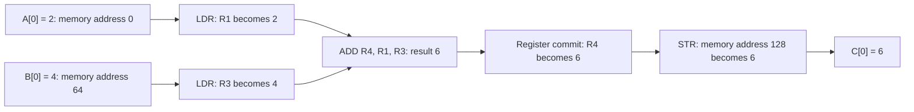

# Hardware Evidence: From A Sum To A Claim

Use this companion after [Follow One Result](tutorial.md). Predict first, inspect
the evidence, then explain which claim it supports. These are questions for
learners, not records of completed learner sessions.

## Follow The Value



The arrows mean value dependencies, not equal clock intervals. In the teaching
trace, Execute computes the result; Writeback changes R4. A later store changes
memory. Hardware monitor times and teaching event indices are different axes.

**Predict:** Does seeing the ALU output 6 prove that C[0] was written?

**Inspect:** Select PC 4 in the experimental kernel evidence, inspect a thread-0
register commit, then inspect the store at PC 7. Match the register value, store
address and stored value. These selections refer to the bundled vector-add
fixture, not an edited Learning lab program.

<details>
<summary>Explain</summary>

No. An arithmetic result can exist without either a register commit or a memory
write. The commit and store are separate pieces of evidence. C[0] needs the store
to address 128; another thread's store does not prove that C[0] changed.

</details>

## Find Where Progress Stops

The compatibility baseline and scheduler-reset experiment execute the same
fixture with different temporary scheduler source variants.

| Observation | Compatibility baseline | Scheduler-reset experiment |
| --- | --- | --- |
| Initial reads | Four transfers complete | Execution continues beyond initial reads |
| Scheduler wait calculation | Accumulator remains set | Accumulator is cleared before each WAIT scan |
| Register commits | 0 of 28 expected | 28 of 28 expected |
| Default termination | TIMEOUT at 4,096 periods | DONE at 145 periods |
| Permitted conclusion | Initial reads did not complete the kernel | This fixture completes with the disclosed change |

**Predict:** If every LSU reports Done, must the scheduler leave WAIT?

**Inspect:** In the baseline's default waveform, the wait accumulator becomes 1
at 155 ns. All four LSUs are Done by 285 ns; the accumulator remains 1. Compare
this signal with the scheduler's WAIT state. Inspect the disclosed source change:

```systemverilog
// Compatibility baseline: declaration initializer.
reg any_lsu_waiting = 1'b0;

// Separate experimental variant: assignment on each WAIT evaluation.
reg any_lsu_waiting;
any_lsu_waiting = 1'b0;
```

<details>
<summary>Explain</summary>

Not necessarily. Done signals do not help if a stale accumulator still says
something is waiting. The experimental assignment recomputes that condition
for each WAIT evaluation. Its success is evidence for this diagnosis on these
fixtures, not proof that every scheduler behavior is correct.

</details>

## Separate Arithmetic From Waiting

Write down predictions before selecting the overflow and delayed-memory fixtures.

| Change | Predict output | Predict completion | Evidence to inspect |
| --- | --- | --- | --- |
| A[3] = 200, B[3] = 100, unsigned 8-bit | C[3] = ? | Must it match ordinary integer arithmetic? | Overflow fixture's commits and output at address 131 |
| Memory response delay 1 becomes 3 | Does C change? | More, fewer or equal clock periods? | Default versus delayed-memory fixture |
| Only the ALU sample passes | Is the entire GPU validated? | Is kernel completion established? | Component report versus kernel report |

<details>
<summary>Check predictions</summary>

Unsigned 8-bit addition gives 300 modulo 256 = 44. The passing overflow fixture
produces [0, 0, 255, 44]. This is defined wraparound, not a wrong sum under that
numeric model.

The delayed-memory experiment keeps [6, 6, 9, 9], but completion increases from
145 to 175 clock periods. The extra 30 periods belong to this testbench and
fixture; they do not establish a general latency formula or GPU speedup.

An ALU pass proves neither kernel completion nor full-GPU correctness. The
baseline demonstrates the distinction: component cases agree while all kernel
fixtures time out.

</details>

## Read The Evidence Boundary

| Evidence available | What it supports | What it does not support |
| --- | --- | --- |
| 31 ALU cases, zero mismatches | Selected arithmetic boundaries, reset and gating agree | Every ALU input, CMP/NZP, division by zero |
| Experimental kernel commits, transfers, fetches and outputs agree | One four-thread vector-add block under three fixtures | Other kernels, multiple blocks, divergent branches |
| Raw VCD and monitor log | Inspectable signal transitions and sampled events | Real-device timing or four-state equivalence |
| Teaching Sequential/SIMD/SIMT schedules | Comparison under explicit teaching rules | Measured CPU/GPU performance |
| Automated checks | Reproducible software assertions | A beginner understood the explanation |

The reports retain original and compiled-source hashes, compatibility edits and
the separate behavioral edit. Never describe an experimental pass as an
unmodified-GPU pass. A timeout is a result to explain, not a report to discard.

## Next Experiments: Not Yet Validated

| Proposed extension | Prediction to record | Required evidence before claiming support |
| --- | --- | --- |
| Dependent ADD followed by MUL | MUL consumes the committed sum | Encoded program, intermediate commits, transfers and independent outputs |
| More than one block | Every block writes its own intended outputs | Dispatch/core identity, complete memory coverage, termination and duplicate checks |
| Divergent branch | Inactive threads do not write branch-only results | Branch encoding support, PCs/masks, commits and memory effects |

These require implementation and HDL execution beyond the current fixtures.
The current kernel runner rejects unsupported opcodes; selecting a teaching
lesson does not create hardware evidence for that lesson.

For commands and fresh execution results, see
[Isolated Hardware Reproduction](hardware-reproduction.md). For source-variant
details, see [Hardware](../hardware/README.md).
