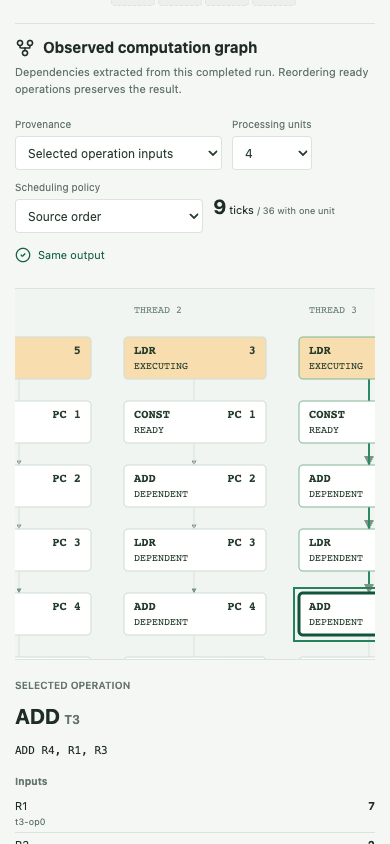

# Keyboard Workflow Audit

Recorded September 16, 2026. Status: partial coverage, four confirmed findings.
Application code, examples, hardware and GOAL.md were not changed by this audit.

October 1 follow-up: the local application now contains repairs for K1-K4.
See [Navigation Repair Verification](navigation-repairs.md) for regression
coverage and limits. The observations below remain the historical pre-repair
record; no screen-reader certification is implied by the follow-up.

The subsequent [Program Studio keyboard follow-up](studio-keyboard-audit.md)
records K5: graph source navigation drops focus in Studio, while retaining the
correct computation. Eight other observations pass. This does not reopen K1-K4.

## Scope And Evidence

Local development URL: `http://127.0.0.1:5175/tinygpu-trace-lab/`.
Playwright-driven, headless Chromium `153.0.8010.12`; reduced motion enabled;
desktop `1440 x 1000` and narrow `390 x 844` viewports.
Navigation, reload and viewport changes established test conditions. Application
actions used keyboard events only; DOM reads and locators inspected outcomes.
No click, programmatic focus, fill or select-option actions were used for the
measured workflows.

The [observation record](evidence/keyboard-audit.json) contains 37 checks:
25 passed, seven failed observations representing four distinct findings, and
five superseded probes. These are exploratory observations, not 37 independent
regression tests. Focus samples record computed styles and bounds; they do not
establish contrast compliance or universal focus visibility.

The pre-audit preservation baseline covers 110 protected files. Its recorded
digest is `50d64238a3c78610e821bf4ac230e2da5f909e6f61696990a3ed5663e9efff96`.
The full regression and hardware results remain those reported in
[Implementation Status](implementation-status.md); neither suite was rerun here.

## Confirmed Findings

### K1: Source Navigation Shows The Wrong Thread

Reproduced at both viewport sizes with default Follow a sum inputs and SIMT.

1. Open Computation graph using Tab and Enter.
2. Tab to `t3-op4: ADD R4, R1, R3`; press Enter.
3. Confirm the inspector identifies `ADD T3`, inputs `7` and `2`, result `9`.
4. Tab to View source event; press Enter.

The learning view opens at writeback, but Thread 0 remains inspected. Its
explanation says `R4 changes from 0 to 6`, not Thread 3's result `9`. Manually
activating Inspect thread 3 restores the matching explanation and ALU value.
This is a provenance/selection defect, not evidence of incorrect arithmetic.
The [desktop destination screenshot](evidence/keyboard-source-navigation-desktop.png)
shows the retained Thread 0 context after selecting Thread 3's source.

[GraphLab](../web/src/components/GraphLab.tsx) passes the selected node's
`eventIndex`. The `onSource` handler in
[LearningLab](../web/src/components/LearningLab.tsx) changes view and seeks the
containing frame without updating `focusedThread`; event selection still uses
the old thread. Future acceptance: source navigation must restore the selected
node's thread, instruction and stage together, including nonzero threads.

### K2: Source Navigation Loses Keyboard Focus

Following the same source action, `document.activeElement` becomes `BODY` on
desktop and narrow viewports. The result persists after two animation frames.
In the earlier desktop traversal, the next Tab landed on 2D rather than the
source instruction or a labelled destination context.

The source button unmounts when the graph view closes. No replacement focus
target is established by that handler. Future acceptance: the transition must
place focus on a stable, meaningful destination and preserve a predictable
continuation path. Correct thread selection alone does not fix focus recovery.

### K3: Focused Graph Nodes Remain Partly Clipped

At `390 x 844`, Tab reaches the Thread 3 ADD node and Enter selects it, but
automatic scrolling leaves part of the node outside the graph viewport. The
node spans horizontal coordinates `299..441`; its scroll container spans
`15..375`. Thus 66 pixels of the 142-pixel-wide node remain clipped by the
container. Its focus outline is present but not fully visible.

The container has `overflow: auto`, `scrollLeft: 271`, `clientWidth: 360` and
`scrollWidth: 760`. The SVG node is individually tabbable, without explicit
focus-driven scroll correction in [GraphLab](../web/src/components/GraphLab.tsx).
Future acceptance: every keyboard-focused node and its outline must fit inside
the visible graph bounds, or have an equivalent fully visible inspection path.
Check both first and last columns, not just the node's top-left coordinate.

### K4: Classic Comparison Selector Has No Accessible Name

In Classic explorer, Tab reaches the select below Comparison Mode. The element
has no associated label, `aria-label`, `aria-labelledby` or title. The adjacent
heading does not programmatically name it. Selection itself works by keyboard.

See `.compare-box` in [App](../web/src/App.tsx). Future acceptance: associate
the control with its visible heading or a proper label; verify the computed
accessible name and actual assistive-technology announcement. No screen-reader
announcement was tested in this audit.

## Working Paths

| Area              | Observed keyboard behavior                                                                                                                                                                                 |
| ----------------- | ---------------------------------------------------------------------------------------------------------------------------------------------------------------------------------------------------------- |
| Guided lesson     | Prediction accepted; load, arithmetic and store checkpoints reached; destination unchanged during execute, committed at writeback; lesson completed and rewound. Changing A[0] produced `[14, 6, 9, 9]`.   |
| Computation graph | Enter activates nodes; processing units and policy change through native type-selection; graph tick advances. This does not negate K1-K3.                                                                  |
| Comparison        | Changing lane width to two produces 18 instruction issues.                                                                                                                                                 |
| Program studio    | Source editing and execution work; conflicting parallel stores rejected; valid single-thread program stores 7 at address 200. Source navigation eventually focuses the editor and selects `STR R0, [200]`. |
| Hardware          | Adder overflow, bit-7 inspection, hardware sample selection, experimental kernel selection and time-slider movement work. This checks controls, not new hardware correctness evidence.                     |
| Classic explorer  | Replay advances from event 18 to 19; Register View retains event 19; comparison selection works despite K4.                                                                                                |
| Narrow 2D         | Activating ALU / LSU after selecting Thread 3 shows operands R1=7, R3=2 and result 9 in the inspector.                                                                                                     |

No browser `pageerror` events were captured. This does not cover console,
network, assistive-technology or other browser errors.

Classic traversal is also cumbersome: a bounded 320-Tab search failed to return
to Register View; extended traversal reached it after another 136 Tabs. These
counts depend on the starting focus and loaded trace. Hundreds of timeline
buttons make repeated forward traversal expensive, but the eventual successful
traversal is not evidence of a keyboard trap. Alternative navigation strategies
and all trace sizes were not evaluated.

## Probe Corrections And Limits

- Native select Home/End probes did not change values, including on a bare
  native-select control. Printable type-selection succeeded. The initial
  probes are retained as superseded, not application findings.
- The studio's first focus snapshot preceded its `requestAnimationFrame`
  update. Waiting for focus and checking the exact selection passed.
- The first narrow graph check tested only top-left visibility. Full bounds
  and the screenshot establish K3 instead.
- The first narrow 2D check only established inspector existence. A subsequent
  check verified actual selected operands and result.
- No real screen reader, human beginner, touch-only user, browser zoom/reflow,
  high-contrast mode, Safari or Firefox evaluation was performed. File dialogs,
  downloads, every lesson, every validation state and 3D keyboard manipulation
  are not covered by this keyboard pass.

Historical next action at this audit's date was to repair K1-K4. Those repairs
now have the October 1 verification linked above. Current next actions are K5,
broader keyboard coverage, human keyboard/screen-reader evaluation and the
[beginner study](beginner-study.md). Accessibility and the overall roadmap
remain incomplete.
