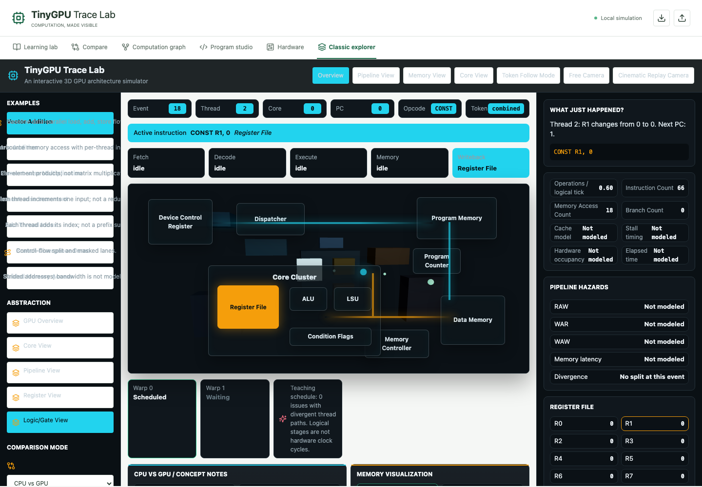
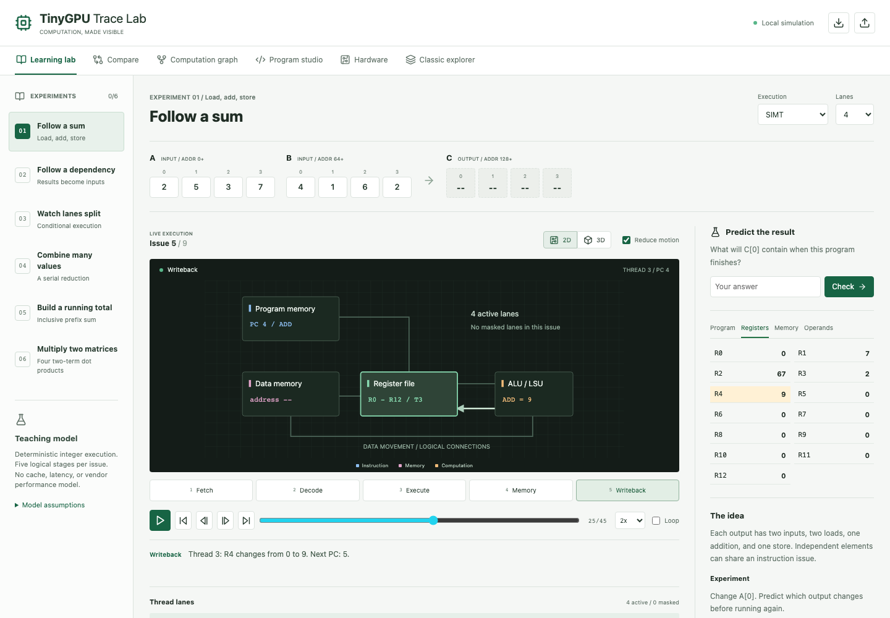

# Selection Continuity Audit

Recorded September 16, 2026. Status: partial evidence, two confirmed gaps.
Documentation and generated evidence only; application code remains unchanged.

## Requirement And Method

[GOAL.md](../GOAL.md) requires selection and execution position to survive
movement between algorithm, machine, core, pipeline and register views. It also
expects learners to leave a lesson and experiment without losing their place.
Retaining an event number while changing only a button highlight is not a
completed multilevel exploration feature.

The [observation record](evidence/selection-continuity.json) contains eight
exploratory checks: six passed, two failed. Testing used local headless Chromium
153.0.8010.12 at `1440 x 1000`, reduced motion enabled, with UI button clicks
and DOM observations. This is not the separate [keyboard audit](keyboard-audit.md)
and does not add eight tests to the automated regression suite.

## Confirmed Gaps

### S1: Classic Abstraction Buttons Do Not Change Detail

1. Open Classic explorer; advance once from event 18 to 19.
2. In the Abstraction section, choose Core View, Pipeline View, Register View
   and Logic/Gate View in turn. These are not the camera-preset buttons.
3. Inspect the selected control, workspace content and architecture diagram.

Each requested abstraction becomes selected. Event 19, workspace text, diagram
markup and `scene overview-focus` remain unchanged for all four selections.
Source inspection confirms why: `Explorer`'s `level` state is read only by the
selected-button styling in [App.tsx](../web/src/App.tsx). It is not passed to
[GpuScene](../web/src/components/GpuScene.tsx) or used to render different
detail. The scene receives only `event` and `cameraMode`.

The separate Hardware lab offers genuine gate inspection, but that does not
make this classic abstraction selector functional. A future implementation must
change the relevant detail and preserve the selected computation, not merely
retain an event number.

### S2: Classic Explorer Loses Its Place After Leaving

After selecting event 19 and Logic/Gate View, switch to Learning lab, then back
to Classic explorer. The classic view resets to event 18 and GPU Overview.
This is a within-session tab transition, not a page reload.

`Explorer` owns its example, event, playback and view state. It is conditionally
mounted by [LearningLab](../web/src/components/LearningLab.tsx), so leaving the
view destroys that state. Future acceptance must cover departure and return,
not only changing abstraction while the same component remains mounted.

## Working Boundaries

For the default Follow a sum lesson, the audit selected Thread 3, the ADD at
PC 4 in writeback, and the Registers inspector. Trace-position control value
24 represents the displayed frame 25/45; it is not a hardware clock cycle.
R4 was 9 and the explanation identified Thread 3's transition from 0 to 9.

That exact state survived both directions of the 2D/3D switch and round trips
through Compare, Computation graph, Hardware and Classic explorer. Each check
compared position, thread, stage/PC, inspector selection, register text and
explanation. These six passing paths establish return-state preservation for
this one learning example, not shared selection across every destination.

The learning and classic views use independent simulation results and cursors.
The learning view here has four lanes; the classic default calls its own
simulation with six threads and two cores. Matching or retained event numbers
would not prove that those views represent the same computation. A coherent
cross-model transition needs an explicit semantic mapping or a clearly disclosed
boundary. Hardware time likewise must not be equated with a teaching frame.

The graph's View source event action remains subject to K1/K2 in the keyboard
audit: returning by the laboratory tab works here; navigating from a selected
graph operation can still lose thread identity and keyboard focus.

## Limits And Next Action

- Default vector addition and desktop Chromium only; no claim about every
  lesson, mobile layout, live playback, imported trace or error-state transition.
- Canvas creation was observed during the 3D switch. No new pixel, camera,
  mesh-selection or screen-reader evaluation was performed.
- No browser page errors were captured. No full regression or HDL suite was
  rerun, and no learner-study result was produced.
- The first probe used an incorrect exact stage-button name and timed out.
  The measured run used the actual numbered stage control; no result is claimed
  for the aborted probe.

Further observation is not a substitute for implementing missing behavior.
S1/S2 and keyboard findings K1-K4 require application changes, which the active
documentation-only restriction does not authorize. Human beginner and
screen-reader sessions also remain necessary. The next implementation step is
to resolve that scope restriction, then repair the confirmed defects with
regression coverage before extending the architecture hierarchy.
