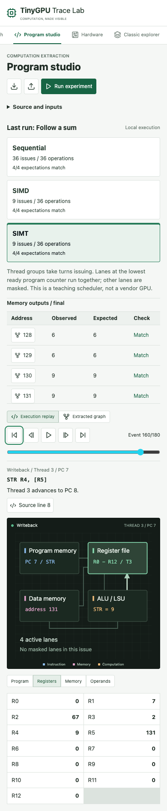

# Program Studio Keyboard Follow-Up

Recorded October 1, 2026. Documentation-only audit of the current local
application. This extends the [earlier keyboard audit](keyboard-audit.md),
not the implementation scope. K1-K4 retain their separately verified repairs.

## K5: Graph Source Navigation Drops Focus

Program Studio's **View source event** restores the correct computation but
leaves `document.activeElement` on `BODY`. Reproduced at 1440 x 1000 and
390 x 844 in headless Chromium 153.0.8010.12, reduced motion enabled.

1. Reload the lab; use Tab and Enter to open **Program studio**.
2. Wait for the default Follow a sum experiment to finish.
3. Tab to **Trace program output 131**; press Enter.
4. Confirm the graph inspector identifies STR T3 and `memory[131] = 9`.
5. Tab to **View source event**; press Enter.
6. After two animation frames, inspect focus and replay state.

| Property | Desktop | Phone |
| --- | --- | --- |
| Replay position | Event 160/180 | Event 160/180 |
| Selected source | Writeback, Thread 3, PC 7 | Writeback, Thread 3, PC 7 |
| Instruction | `STR R4, [R5]` | `STR R4, [R5]` |
| Register values | R4 = 9, R5 = 131 | R4 = 9, R5 = 131 |
| Focus after transition | `BODY` | `BODY` |
| Next Tab | First program event | First program event |

The source event is the store's Writeback event; this is not a claim that the
memory write occurred at Writeback. The graph's stored result and replay's
instruction/thread agree. The defect is loss of an explicit focused destination,
not incorrect arithmetic, a wrong-thread selection or a keyboard trap. The next
Tab still reaches the replay controls on both measured viewports.

In [ProgramStudio.tsx](../web/src/components/ProgramStudio.tsx), the `GraphLab`
`onSource` callback calls `setEventIndex(index)` and `setView("execution")`.
The focused graph button unmounts; the callback does not focus its replacement.
`ProgramReplay` renders a labelled section without a programmatic focus target.
This is a different caller from the repaired Learning lab source transition.

### Future Acceptance

- Restore focus to a meaningful labelled replay destination after it mounts.
- Preserve the selected event, thread, instruction and register state.
- Keep the next Tab within a predictable replay workflow.
- Test departure from the graph using real Tab/Enter traversal at desktop and
  narrow widths, not only a directly focused locator.
- Verify announcements with a real screen reader. DOM focus assertions alone
  do not establish what an assistive-technology user hears.

No application fix was applied under the documentation-only restriction.

### Authorized Repair Follow-Up

After the restriction was lifted, Program Studio gained a programmatic replay
focus target and event description. Graph source navigation focuses this region
after it mounts; the next Tab reaches First program event. Model selection alone
does not move focus into replay. Desktop/mobile regression checks retain the
selected Thread 3 / PC 7 store under Sequential, SIMD and SIMT.

The new regression uses explicit locator focus followed by Enter and Tab, not a
repeat of the complete keyboard-only traversal above. Actual screen-reader
announcements remain untested. The original screenshots and JSON remain the
unchanged pre-fix evidence. See [repair verification](navigation-repairs.md).

## Working Workflows

The [observation record](evidence/studio-keyboard-audit.json) contains ten
observations: eight pass, two fail, representing one distinct finding. These
are exploratory checks, not additions to the automated regression-test count.

| Workflow | Result at both widths |
| --- | --- |
| Trace output 131 | Correct STR T3 provenance, result 9 |
| Return to source | Correct Thread 3 / PC 7 replay identity |
| Invalid source `BOGUS R0, 1` | Alert identifies the unsupported opcode and line 1 |
| Failed run | Previous replay retained exactly; draft-change status visible |
| Restore valid source and rerun | Alert clears; reference expectations match |

On the phone layout, **Source and inputs** is collapsed after running. Keyboard
activation of that disclosure makes the source editable again. Initial probes
tried reaching a hidden textarea and exhausted their Tab budgets; those aborted
probes are not keyboard-trap findings. The completed audit opens the disclosure
before editing, using Tab/Shift+Tab and Enter.

The screenshot shows the recovered next-Tab state, not the preceding `BODY`
focus. That preceding focus is recorded explicitly in the JSON observations.
A [desktop screenshot](evidence/studio-keyboard-1440.png) records the same stage.

## Evidence And Limits

Measured application actions used keyboard events only. Browser navigation,
viewport setup, DOM inspection and screenshots used Playwright. There were no
clicks, `focus()`, `fill` or `selectOption` calls in the measured workflows.
No browser `pageerror` events were captured.

The record includes before-state SHA-256 hashes for 76 files across `web/src`,
`web/public`, `simulator/src`, `hardware` and `GOAL.md`. Every after-state hash
matched. Existing uncommitted work was preserved.

The local development server responded at
`http://127.0.0.1:5175/tinygpu-trace-lab/`. No new production build, full browser
suite or HDL run was performed in this pass. Default vector addition only;
other programs, imports, downloads, zoom/reflow, Safari, Firefox, touch-only
interaction and actual screen readers remain outside this evidence.

A separate native-select probe in Hardware timed out without confirming the
requested source selection. It is inconclusive and excluded from the ten
observations. This record makes no new claim about Hardware keyboard support.
